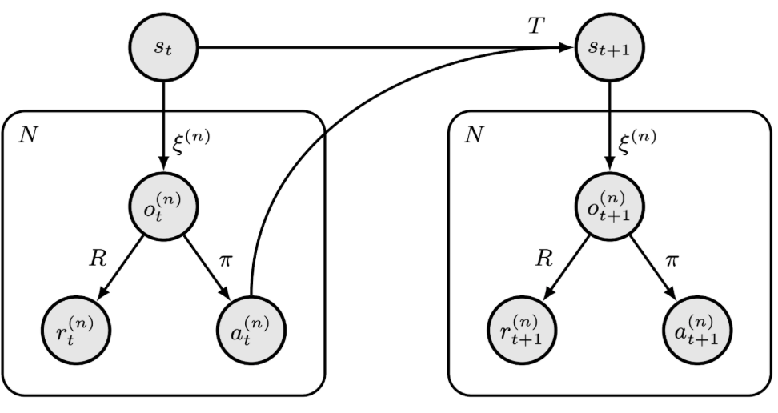
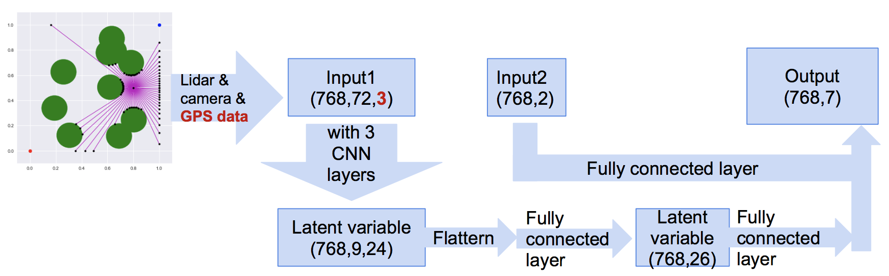
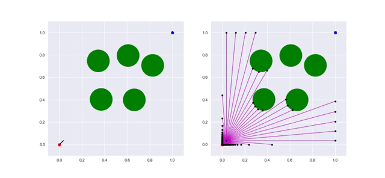
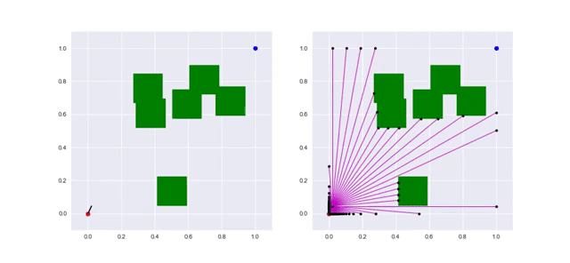

# How to learn the policy for path planning?

---

## Motivation 

It is widely acknowledged that humans and animals often learn how to perform tasks through imitation, a process that consists of observation on experienced performer and taking appropriate actions inferring to their observation. Similar to this process, researchers have developed techniques for imitation learning to simulate this learning process for automous agents, such as self-driving cars. Illustrated by the figure below, what the learning agent can observe is the state and action s_t,a_t) at each timestep, with the action being a result of policy. Then a natural inverse quetsion to ask is that how to clone the policy, so that for the agent in a new environment, it can still make some sensible decisions on the action to take? In industry, extending this paradigm to autonomous agents is a well-studied problem in general (Bojarski et al, 2016; Torabi et al, 2018). Inspired by the existing algorithms in industry to develop self-driving agents, we proposed a simple path-planning problem to clone the policy generated by a state-of-the-art path planning algorithm with access to fully observed environment (treated as the experienced task performer), with the aim to employ the NN techniques learnt from class. Moreover, we hope to develop a more thorough understanding of designing data input, building model and analysing data through this bottom-up approach and to allow our model be applied to other general problems. 

## Layout of the problem

For this project, we set up a path planning problem, cloning the behaviour of an agent that navigates through obstacles to reach a target location, with partially observed environment. First, we use a state-of-the-art algortithm, Rapidly-exploring Random Tree (RRT), with fully observed environment to plan the "optimal path". Then, we take the policy of this "optimal path" as (𝑠𝑡, 𝑎𝑡) input into the built NN model to clone the policy. Last, we employ the policy learnt on the agent to navigate its path among new environments, with the obstacles moved from their original locations during training and with obstacles having different shape respectively.

## Flowchart of the model framework

## Metric to evaluate the model performance

First, we used the conventional metrics: training and test losses and prediction accuracy to evaluate the model performance. However, after discussion with Professor Michael Brenner, we concluded that these may not be a good indicator of the model performance for a specific application for automous driving agents to plan path under new environments. Instead, we set the metric to be the success rate of the agent finding a path with no collision with any obstacle/wall in new environments (different obstacle number, obstacle shape) with CNN-only and CNN+LSTM model respectively. Results are discussed and concluded in the later section "Discussion and Conclusion".

## Visualization of the planning policy

## Discussion and Conclusion

| Model: CNN        | Temperature=0.3      | Temperature=0.15     | Temperature=0.01     |
|-------------------|----------------------|----------------------|----------------------|
| Step size = 0.05  | Circ: 66% - Sq: 66% | Circ: 76% - Sq: 64% | Circ: 69% - Sq: 71% |
| Step size = 0.025 | Circ: 77% - Sq: 84% | Circ: 88% - Sq: 69% | Circ: 86% - Sq: 87% |

| Model: CNN + LSTM | Temperature=0.3     | Temperature=0.15    | Temperature=0.01    |
|-------------------|---------------------|---------------------|---------------------|
| Step size = 0.05  | Circ: 70% - Sq: 57% | Circ: 77% - Sq: 65% | Circ: 66% - Sq: 71% |
| Step size = 0.025 | Circ: 86% - Sq: 86% | Circ: 85% - Sq: 90% | Circ: 93% - Sq: 94% |

1, The above table summarises the success rate of finding a path with no collision with any obstacle/wall in new environments (different obstacle number, obstacle shape) with CNN-only and CNN+LSTM model respectively. There are two hyperparameters that can vary for parametric study: step size and temperature in the softmax activation layer. To reduce the step size is equivalent to increasing the sensors' update frequency. To increase the temperature leads to the agent's policy tending to be a uniformly random one; otherwise it tends to be a fully deterministic greedy policy.

Here, we can see, in the most cases, our agent performs equally well with circle obstacles (used in training set) and square obstacles (not in training set), which shows the generalization of our policy. And with LSTM, the agent's success rate reaches the max value in 0.01 Temperature and 0.025 step size, about 93.5%, while without LSTM, the max success rate is about 86.5%.

One of the reason for LSTM to increase the performance is that agent can plan in advance and know how to avoid the most likely failure case for model without LSTM: bumping into the wall when being extremely closed to the ending point, not having collision with obstacles.

Another reason could be that LSTM can implicitly build a map of the environment, which can surely help increase the performance.

2, Compared with the expert (RRT algorithm), the neural network can make decision when there's only local information of the environment. Besides, the neural network can also work in a dynamic environment, while RRT has to replan frequently. Therefore, the computational complexity of neural network can be potentially much lower than RRT.

## References

Banzhaf, Holger, et al. "Learning to predict ego-vehicle poses for sampling-based nonholonomic motion planning." IEEE Robotics and Automation Letters 4.2 (2019): 1053-1060.

Bojarski, Mariusz, et al. "End to end learning for self-driving cars." arXiv preprint arXiv:1604.07316 (2016).

Choudhury, Sanjiban, et al. "Data-driven planning via imitation learning." The International Journal of Robotics Research 37.13-14 (2018): 1632-1672.

Codevilla, Felipe, et al. "End-to-end driving via conditional imitation learning." 2018 IEEE International Conference on Robotics and Automation (ICRA). IEEE, 2018.

Torabi, Warnell and Stone, "Behavior Cloning from Observation." In Proceedings of the 27th International Joint Conference on Artificial Intelligence (IJCAI 2018), Stockholm, Sweden, July 2018.
